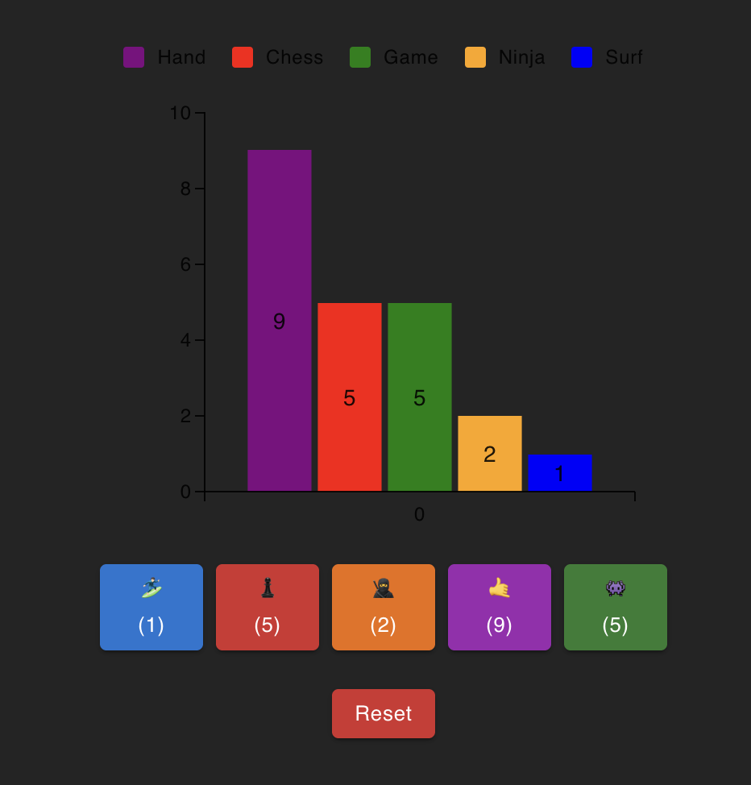

# 🧮 Counter BarChart

An practice React app for tracking activity counts using colorful buttons and a live-updating bar chart. Each button represents an activity with a unique emoji and color, and the state is persisted using localStorage, so data is preserved on page reloads.

## 🔥 Features

- ✅ Live counters for multiple activities (e.g., Surf, Chess, Ninja, etc.)

- 📊 Dynamic bar chart sorted from highest to lowest count

- 🎨 Matching bar colors based on the button color

- 💾 Persistent state using localStorage

- ⚡ Optimized performance with useMemo, useCallback, and useEffect

- 🧱 Modular architecture with reusable components and clean separation of logic

## 🛠️ Tech Stack

- React 19
- TypeScript
- Material UI
- `@mui/x-charts` for rendering the bar chart
- `localStorage` for persistence
- Tailwind for styling

## 🚀 Getting Started

Clone the repo and run the development server:

```
git clone https://github.com/WardVerc/counter-barchart
cd counter-barchart
npm install
npm run dev
```

## 📸 Preview


